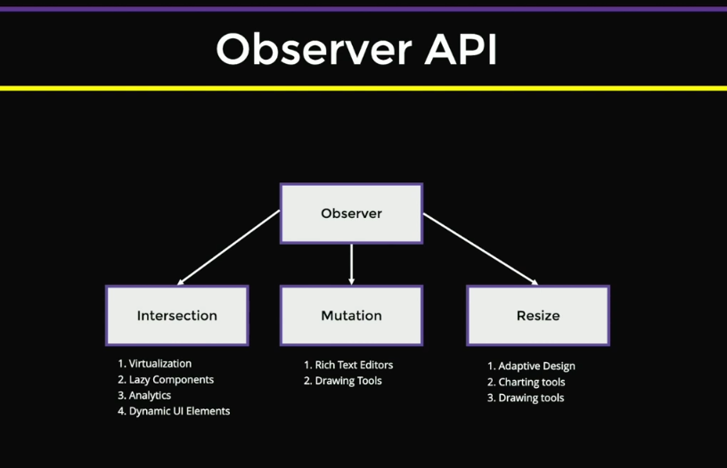

# Box Model

Box properties: Block size y block type

# Browser formatting context

Cuando un elemento nuevo es creado, entra al formatting context actual, si ese elemento lleva estilos, se crea un nuevo formatting context isolado. Por ejemplo los spans crean inline formatting context de manera implicita.

3 key ideas

1. Isolation: Elements within the context are shielded from external rules,
2. Scalability: New rule sets can be introduced by creating a new context,
3. Predictability: A strict set of rules allows for consistent element positioning

The block formatting context is set by default when an HTML page is initiated

# Dom Templating Exercise

The <template> tag stores HTML in a lightweight object in memory, which is not queryable by DOM API, not rendered in the final render tree, and allows for creating reusable HTML components

Document fragments exist in memory and do not trigger reflow, allowing for efficient modifications without causing performance overhead in the DOM tree

la solucion esta en la branch 1-dom-end

# Observer API

- What are the three main types of the Observer API?
  Intersection Observer, Mutation Observer, and Resize Observer

- What is an Intersection Observer primarily used for?
  Virtualization pattern, lazy component rendering, analytics tracking of website visibility, and creating dynamic UI elements

- What properties does an Intersection Observer configuration object typically have?
  Root (container being tracked against), threshold (ratio of intersection), and callback function

- How much faster are Intersection Observers compared to vanilla JavaScript tracking approaches?
  On average, 50 times faster, it has an observer that checks all the elements

- What are the two cases when an Intersection Observer callback is triggered?
  When the target element starts intersecting and when the intersection stops

- What property helps determine if an element is currently intersecting?
  isIntersecting

- What are the two parameters accepted by the Intersection Observer constructor?
  Callback function and config object

### Infinite scroll with intersection observer

coding branch `2-intersection-observer-begin` y solucion `2-intersection-observer-end`

- What method is used to minimize DOM mutations when adding new elements?
  Using a document fragment to accumulate DOM updates before appending them to the list in a single operation

- What configuration parameter is set for the Intersection Observer?
  The threshold is set to 0.2, which means the callback will trigger when 20% of the observed element is visible

- How is the page number tracked when fetching new data?
  A variable is initialized to 0 and incremented by 1 each time new data is fetched

- What steps are involved in rendering new cards?
  Fetch new data using MockDB
  Create a document fragment
  Create card elements for each data item
  Append card elements to the fragment
  Append the entire fragment to the list container

## Mutation observer

- What is the primary purpose of the Mutation Observer in JavaScript?
  The Mutation Observer allows tracking changes within the DOM subtree, such as detecting modifications to child elements, attributes, or text content at a native level, which is particularly useful for applications like rich text editors.

- What are the main configuration options for a Mutation Observer?
  The main configuration options are: childList (track direct child changes), attributes (track attribute modifications), characterData (track text content changes), and subtree (track changes across the entire subtree). Best practice is to configure these options carefully to avoid excessive callback invocations.

- What properties does a Mutation Record provide?
  A Mutation Record provides properties including: type (mutation type like attribute change or element addition), target node (which triggered the mutation), added/removed nodes array, and old character data value for tracking changes in the DOM.

- What advantage does a native Mutation Observer have over previous JavaScript-level implementations?
  A native Mutation Observer is implemented at the browser level, which makes it much faster and more memory-efficient compared to previous JavaScript-level polyfills that would create proxy objects to track mutations.

- What happens if both 'childList' and 'subtree' options are set to true in a Mutation Observer?
  When both 'childList' and 'subtree' are set to true, the 'childList' option takes precedence, which means the subtree option will not work, and only direct child changes will be observed.

### Mutation observer Exercise
- What attribute makes an HTML element editable by the user?
content-editable="true"

- What are the key steps in creating a Mutation Observer?
Create a mutation observer with a callback function, 2. Filter for specific mutation types, 3. Check target element and text content, 4. Replace element if conditions are met, 5. Observe the target element with configuration settings

- What mutation type is used to track typing or text changes in a Mutation Observer?
characterData

- What configuration property allows deep checking of DOM changes in a Mutation Observer?
subtree: true

- What method is used to replace an existing DOM element with a new element?
replaceWith() method

## Resize Observer
- What are the two main methods for handling changes when resizing a web page?
CSS media queries and the resize event

- Why is the resize event considered slow?
Because it relies on standard DOM events, requires traversing the entire DOM tree, and can be fired up to 5,000 times during a small resize

- What is the primary advantage of ResizeObserver over the resize event?
ResizeObserver is approximately 10 times faster, supports callbacks, and can track multiple element resizes simultaneously

- What two box types can be used with ResizeObserver?
Content box (tracks inner rectangle size) and border box (includes border and padding in resize calculations)

- Why does ResizeObserver return an array of boxes instead of a single box?
The specification anticipates future HTML elements with multi-column layouts, allowing potential tracking of multiple boxes within a single element